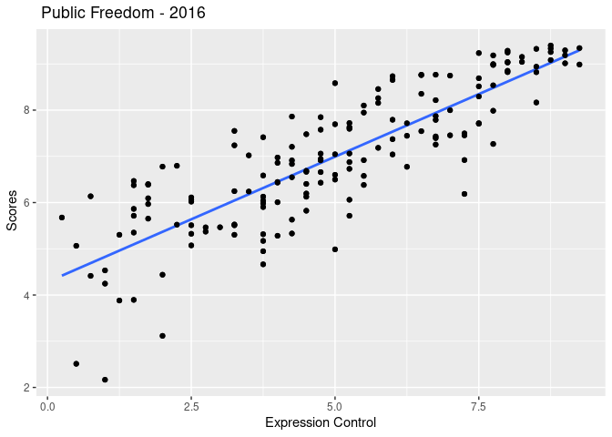

Activity 2 - Day 1
================

### Loading the packages

``` r
library(tidyverse)
```

    ## ── Attaching packages ─────────────────────────────────────── tidyverse 1.3.2 ──
    ## ✔ ggplot2 3.4.0     ✔ purrr   0.3.4
    ## ✔ tibble  3.1.8     ✔ dplyr   1.0.9
    ## ✔ tidyr   1.2.0     ✔ stringr 1.4.1
    ## ✔ readr   2.1.2     ✔ forcats 0.5.2
    ## ── Conflicts ────────────────────────────────────────── tidyverse_conflicts() ──
    ## ✖ dplyr::filter() masks stats::filter()
    ## ✖ dplyr::lag()    masks stats::lag()

``` r
library(tidymodels)
```

    ## ── Attaching packages ────────────────────────────────────── tidymodels 1.0.0 ──
    ## ✔ broom        1.0.0     ✔ rsample      1.1.0
    ## ✔ dials        1.0.0     ✔ tune         1.0.0
    ## ✔ infer        1.0.3     ✔ workflows    1.0.0
    ## ✔ modeldata    1.0.0     ✔ workflowsets 1.0.0
    ## ✔ parsnip      1.0.1     ✔ yardstick    1.0.0
    ## ✔ recipes      1.0.1     
    ## ── Conflicts ───────────────────────────────────────── tidymodels_conflicts() ──
    ## ✖ scales::discard() masks purrr::discard()
    ## ✖ dplyr::filter()   masks stats::filter()
    ## ✖ recipes::fixed()  masks stringr::fixed()
    ## ✖ dplyr::lag()      masks stats::lag()
    ## ✖ yardstick::spec() masks readr::spec()
    ## ✖ recipes::step()   masks stats::step()
    ## • Learn how to get started at https://www.tidymodels.org/start/

### Task3: Load the data

``` r
hfi <- readr::read_csv("https://www.openintro.org/data/csv/hfi.csv")
```

    ## Rows: 1458 Columns: 123
    ## ── Column specification ────────────────────────────────────────────────────────
    ## Delimiter: ","
    ## chr   (3): ISO_code, countries, region
    ## dbl (120): year, pf_rol_procedural, pf_rol_civil, pf_rol_criminal, pf_rol, p...
    ## 
    ## ℹ Use `spec()` to retrieve the full column specification for this data.
    ## ℹ Specify the column types or set `show_col_types = FALSE` to quiet this message.

``` r
hfi
```

    ## # A tibble: 1,458 × 123
    ##     year ISO_code countr…¹ region pf_ro…² pf_ro…³ pf_ro…⁴ pf_rol pf_ss…⁵ pf_ss…⁶
    ##    <dbl> <chr>    <chr>    <chr>    <dbl>   <dbl>   <dbl>  <dbl>   <dbl>   <dbl>
    ##  1  2016 ALB      Albania  Easte…    6.66    4.55    4.67   5.29    8.92      10
    ##  2  2016 DZA      Algeria  Middl…   NA      NA      NA      3.82    9.46      10
    ##  3  2016 AGO      Angola   Sub-S…   NA      NA      NA      3.45    8.06       5
    ##  4  2016 ARG      Argenti… Latin…    7.10    5.79    4.34   5.74    7.62      10
    ##  5  2016 ARM      Armenia  Cauca…   NA      NA      NA      5.00    8.81      10
    ##  6  2016 AUS      Austral… Ocean…    8.44    7.53    7.36   7.78    9.62      10
    ##  7  2016 AUT      Austria  Weste…    8.97    7.87    7.67   8.17    9.74      10
    ##  8  2016 AZE      Azerbai… Cauca…   NA      NA      NA      4.27    9.14      10
    ##  9  2016 BHS      Bahamas  Latin…    6.93    6.01    6.26   6.40    0         10
    ## 10  2016 BHR      Bahrain  Middl…   NA      NA      NA      5.90    9.79      10
    ## # … with 1,448 more rows, 113 more variables:
    ## #   pf_ss_disappearances_violent <dbl>, pf_ss_disappearances_organized <dbl>,
    ## #   pf_ss_disappearances_fatalities <dbl>, pf_ss_disappearances_injuries <dbl>,
    ## #   pf_ss_disappearances <dbl>, pf_ss_women_fgm <dbl>,
    ## #   pf_ss_women_missing <dbl>, pf_ss_women_inheritance_widows <dbl>,
    ## #   pf_ss_women_inheritance_daughters <dbl>, pf_ss_women_inheritance <dbl>,
    ## #   pf_ss_women <dbl>, pf_ss <dbl>, pf_movement_domestic <dbl>, …

1.  what are the dimensions of the data set what does each row
    represent? Ans. There are 1458 rows and 123 columns,it represents
    the Human Freedom Index

## Filtering out the year 2016 from the dataset

``` r
hfi_2016 <- hfi %>% filter(year == 2016) # using hfi_2016 as new object to store the values of the year 2016 from the original file
hfi_2016
```

    ## # A tibble: 162 × 123
    ##     year ISO_code countr…¹ region pf_ro…² pf_ro…³ pf_ro…⁴ pf_rol pf_ss…⁵ pf_ss…⁶
    ##    <dbl> <chr>    <chr>    <chr>    <dbl>   <dbl>   <dbl>  <dbl>   <dbl>   <dbl>
    ##  1  2016 ALB      Albania  Easte…    6.66    4.55    4.67   5.29    8.92      10
    ##  2  2016 DZA      Algeria  Middl…   NA      NA      NA      3.82    9.46      10
    ##  3  2016 AGO      Angola   Sub-S…   NA      NA      NA      3.45    8.06       5
    ##  4  2016 ARG      Argenti… Latin…    7.10    5.79    4.34   5.74    7.62      10
    ##  5  2016 ARM      Armenia  Cauca…   NA      NA      NA      5.00    8.81      10
    ##  6  2016 AUS      Austral… Ocean…    8.44    7.53    7.36   7.78    9.62      10
    ##  7  2016 AUT      Austria  Weste…    8.97    7.87    7.67   8.17    9.74      10
    ##  8  2016 AZE      Azerbai… Cauca…   NA      NA      NA      4.27    9.14      10
    ##  9  2016 BHS      Bahamas  Latin…    6.93    6.01    6.26   6.40    0         10
    ## 10  2016 BHR      Bahrain  Middl…   NA      NA      NA      5.90    9.79      10
    ## # … with 152 more rows, 113 more variables: pf_ss_disappearances_violent <dbl>,
    ## #   pf_ss_disappearances_organized <dbl>,
    ## #   pf_ss_disappearances_fatalities <dbl>, pf_ss_disappearances_injuries <dbl>,
    ## #   pf_ss_disappearances <dbl>, pf_ss_women_fgm <dbl>,
    ## #   pf_ss_women_missing <dbl>, pf_ss_women_inheritance_widows <dbl>,
    ## #   pf_ss_women_inheritance_daughters <dbl>, pf_ss_women_inheritance <dbl>,
    ## #   pf_ss_women <dbl>, pf_ss <dbl>, pf_movement_domestic <dbl>, …

## Linear Model for Prediction

``` r
pf_model <- lm(pf_score ~ pf_expression_control, data = hfi_2016)
pf_model
```

    ## 
    ## Call:
    ## lm(formula = pf_score ~ pf_expression_control, data = hfi_2016)
    ## 
    ## Coefficients:
    ##           (Intercept)  pf_expression_control  
    ##                4.2838                 0.5418

``` r
ggplot(hfi_2016, aes(x = pf_expression_control, y = pf_score)) +
  geom_point() +
  geom_smooth(method = "lm", se = FALSE)+
geom_point() + 
  labs(title = " Public Freedom - 2016 ",
              x = "Expression Control", y = " Scores" )
```

    ## `geom_smooth()` using formula = 'y ~ x'

<!-- -->

Q. Does the relationship looks linear? Ans. Yes, the linear predictor
line looks strongly linear and would definitely be able to use this
model to predict the personal freedom scores.

### Task 4

The smallest number that I ever got was 271.362, and my best one yet is
307.98. My neighbors have somewhat similar results.

### Taks 5

``` r
 m1 <- lm(pf_score ~ pf_expression_control, data = hfi_2016)
tidy(m1)
```

    ## # A tibble: 2 × 5
    ##   term                  estimate std.error statistic  p.value
    ##   <chr>                    <dbl>     <dbl>     <dbl>    <dbl>
    ## 1 (Intercept)              4.28     0.149       28.8 4.23e-65
    ## 2 pf_expression_control    0.542    0.0271      20.0 2.31e-45

### Activity 2 - Day 2

``` r
a <- cor(hfi_2016$pf_expression_control, hfi_2016$pf_score)
```

The correlation coefficient between pf\_expression\_control and
pf\_Score is 0.8450646. This means that both are highly correlated.

``` r
glance(m1)
```

    ## # A tibble: 1 × 12
    ##   r.squared adj.r.squa…¹ sigma stati…²  p.value    df logLik   AIC   BIC devia…³
    ##       <dbl>        <dbl> <dbl>   <dbl>    <dbl> <dbl>  <dbl> <dbl> <dbl>   <dbl>
    ## 1     0.714        0.712 0.799    400. 2.31e-45     1  -193.  391.  400.    102.
    ## # … with 2 more variables: df.residual <int>, nobs <int>, and abbreviated
    ## #   variable names ¹​adj.r.squared, ²​statistic, ³​deviance

The Value of R-squared in the model is 0.714, which means that 71.4
percent of the variation can be explained by the model.

``` r
pf_m <- lm(hf_score ~ pf_expression_control, data = hfi_2016)
pf_m
```

    ## 
    ## Call:
    ## lm(formula = hf_score ~ pf_expression_control, data = hfi_2016)
    ## 
    ## Coefficients:
    ##           (Intercept)  pf_expression_control  
    ##                5.0534                 0.3684

``` r
ggplot(hfi_2016, aes(x = pf_expression_control, y = hf_score)) +
  geom_point() +
  geom_smooth(method = "lm", se = FALSE)+
geom_point() + 
  labs(title = " Public Freedom - 2016 ",
              x = "Expression Control", y = " Hf - Scores" )
```

    ## `geom_smooth()` using formula = 'y ~ x'

<!-- -->

The slope is linear, which means both the values have a high correlation
coefficient, therefore the linear equation for the model will be:
hf\_score = 5.0534 + 0.3684 \* pf\_expression\_control.

Higher the pf\_expression\_control value, higher would be the the
hf\_score, I believe it is an overestimate because the residuals value
are positive.

``` r
m1_aug <- augment(m1)
m1_aug
```

    ## # A tibble: 162 × 8
    ##    pf_score pf_expression_control .fitted .resid    .hat .sigma  .cooksd .std.…¹
    ##       <dbl>                 <dbl>   <dbl>  <dbl>   <dbl>  <dbl>    <dbl>   <dbl>
    ##  1     7.60                  5.25    7.13  0.468 0.00625  0.801 0.00108    0.587
    ##  2     5.28                  4       6.45 -1.17  0.00729  0.796 0.00792   -1.47 
    ##  3     6.11                  2.5     5.64  0.473 0.0133   0.801 0.00239    0.596
    ##  4     8.10                  5.5     7.26  0.836 0.00648  0.799 0.00359    1.05 
    ##  5     6.91                  4.25    6.59  0.326 0.00679  0.801 0.000573   0.409
    ##  6     9.18                  7.75    8.48  0.701 0.0150   0.800 0.00594    0.884
    ##  7     9.25                  8       8.62  0.628 0.0166   0.800 0.00531    0.793
    ##  8     5.68                  0.25    4.42  1.26  0.0319   0.795 0.0422     1.60 
    ##  9     7.45                  7.25    8.21 -0.758 0.0121   0.799 0.00556   -0.954
    ## 10     6.14                  0.75    4.69  1.45  0.0268   0.793 0.0463     1.83 
    ## # … with 152 more rows, and abbreviated variable name ¹​.std.resid

``` r
ggplot(data = m1_aug, aes(x = .fitted, y = .resid)) +
  geom_point() +
  geom_hline(yintercept = 0, linetype = "dashed", color = "red") +
  xlab("Fitted values") +
  ylab("Residuals")
```

<!-- -->

The points appear to be random and not in a pattern in the residuals
plot. The distributions are symmetric, however, there are outliers (2).

``` r
ggplot(data = m1_aug, aes(x = .resid)) +
  geom_histogram(binwidth = 0.25) +
  xlab("Residuals")
```

<!-- -->

Looking at the histogram, I believe that the model is a bit skewed
towards the left, this also means the residuals are not linearly
separated and most of the residuals are negative.
